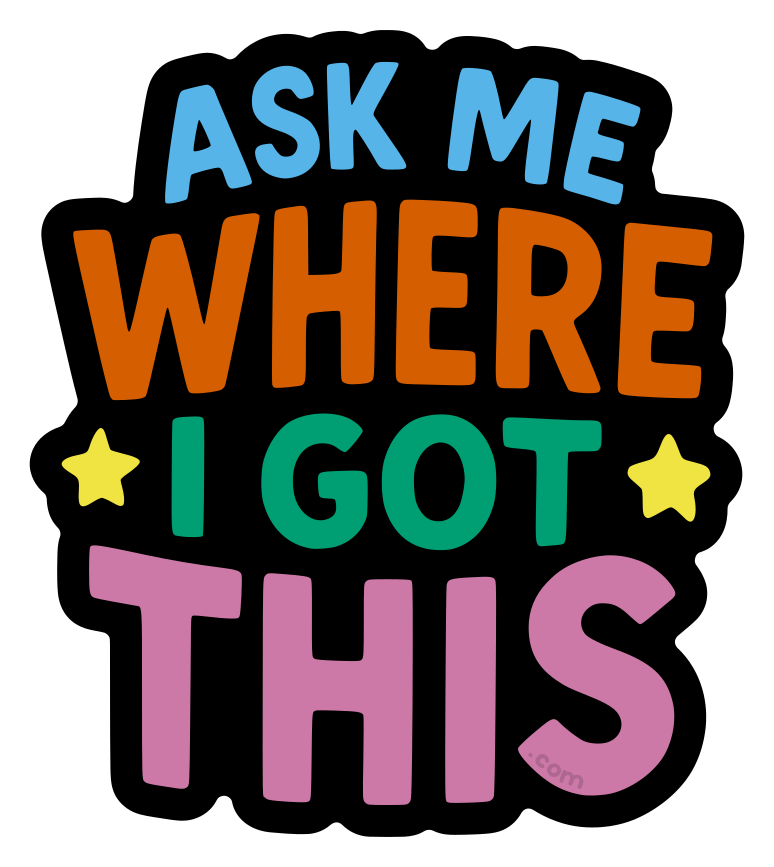

# [Ask Me Where I Got This](https://askmewhereigotthis.com)

## What is this?
A fun sticker to share with friends!

## What does the sticker look like?

## How do I get this?

### Sharing
Ask someone who has one of these stickers!

### Ordering
<!-- TODO: Add affiliate link for easy printing -->
Feel free to use the design to print the stickers yourself!

## I have these stickers, what do I do?
If someone asks you "where did you get that?" give them a handful of stickers to do the same!

## What's the background of this?
"Ask me where I got this" was born in the hallway track at PyConUS in 2025, from a conversation around an attendee asking "where did you get that badge ribbon?".

Quickly the joke was made that the ribbon could say that, and that the person answering the question would take out half their collection to give away to the asker, allowing them to spread the love.

## How was this designed?
<!-- TODO: Add links to chat gpt conversation -->
<!-- TODO: Add link to colourblind pallet -->
The sticker was designed using Chat GPT, converted to SVG using Inkscape, and the colours were manually tweaked to use a colourblind accessible pallet.

## Where can I find the repo?
https://github.com/ekohilas/ask-me-where-i-got-this

## What is the liscence?

 
<a href="askmewhereigotthis.com">Ask Me Where I Got This - Sticker</a> © 2025 by <a href="https://github.com/ekohilas">Evan Kohilas</a> is licensed under <a href="https://creativecommons.org/licenses/by-nc-sa/4.0/">CC BY-NC-SA 4.0</a>
